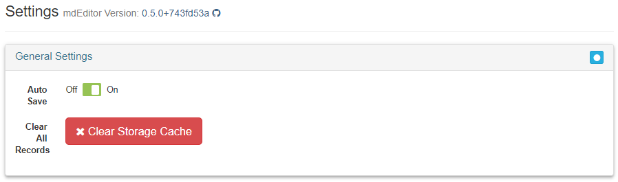

# Settings {#settings}

The settings menu allows for the configuring of user-specific options. 

## General Settings
**mdEditor Version**: The mdEditor version notes the current version of mdEditor. Use this when reporting errors. Errors can be reported at https://github.com/adiwg/mdEditor/issues. You must have a github account in order to post.

**Auto-Save**: The Auto-Save option will write all changes to local storage when you exit a data entry field. Changes must be manually saved if the Auto-Save feature is turned off.

Auto-Save allows you to save less frequently, but it makes it harder to undo changes that you make to your records. If you stay on the same record, you can cancel changes. But once you leave the record, the record is saved and you can’t cancel the change except by manually re-editing the record.

**Clear All Records**: All records can be cleared by clicking the "Clear Storage Cache." Be sure to back up all records (project and product records to the project's archive folder, contacts and data dictionaries to the program's archive folder) before clearing all records. 

```{block, settings_clearing-caution, type='rmdcaution'}
Clearing all records will delete all of the records currently loaded in mdEditor. Before doing so, use the Export function to make a backup of your records. Otherwise, the records will be permanently lost (unless you previously made a backup copy).
```



***

## ScienceBase Import Settings
[Under development]

***

## Defaults
Defaults include settings for Language, Character Set, Country, and the *Import URL *(used for defining the default URL for importing).

<need to insert image here>

The following defaults will be pre-loaded:
- default language: English
- default character set: UTF-8
- default location: USA

Also included in **Defaults** are the **Metadata Repositories** (online databases for storing metadata). Once entered in **Settings** these can then be selected for projects and products so that they are flagged to a metadata repository of your choice. 

***

## Publishing Settings
[Under development]