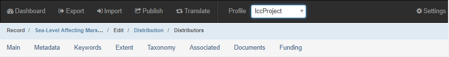
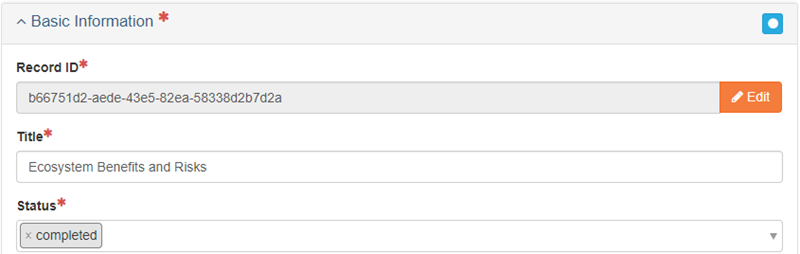
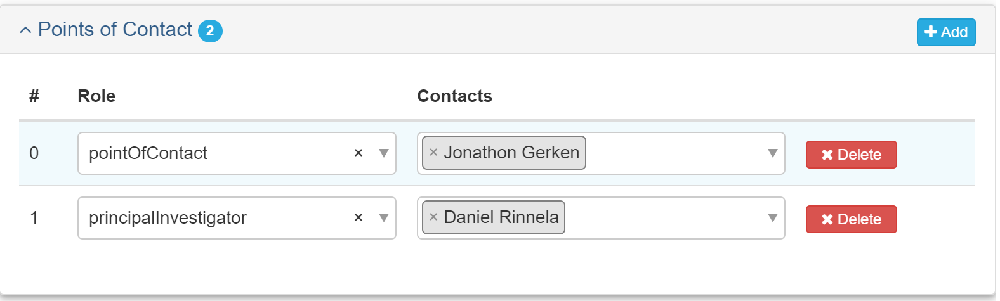
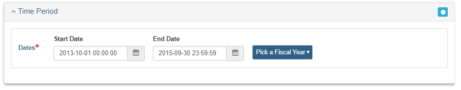
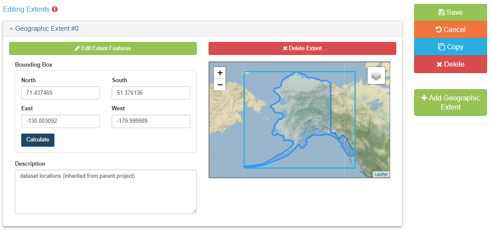
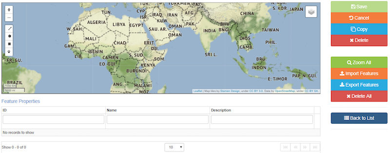
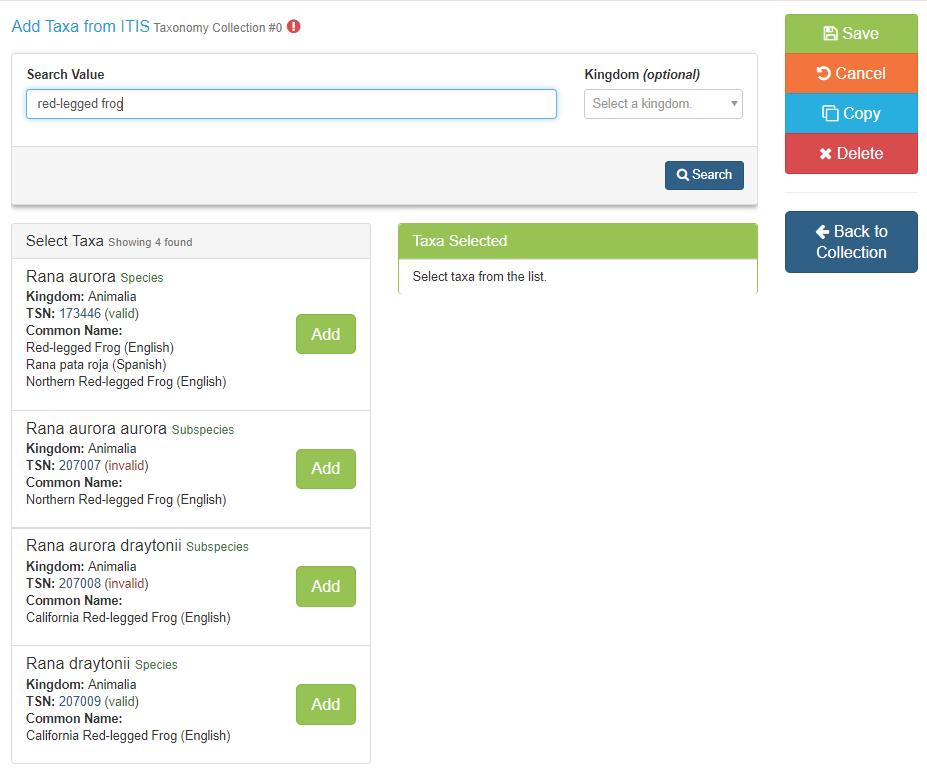
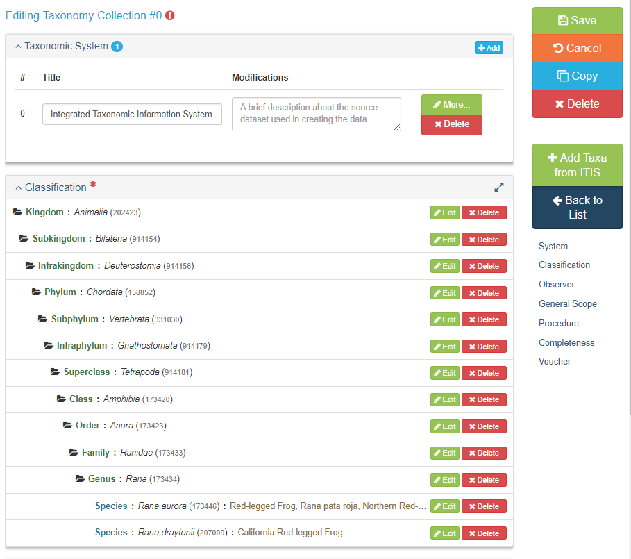
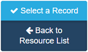
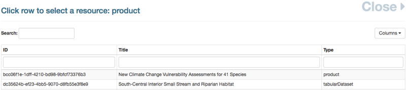

# Project Entry Guidance {-}
The Project Entry Guidance section will cover how to create a metadata record for an AK-Region project.

***

## Before You Begin {-}

### Select the lccProject Profile: {-}
After creating your project record and before you begin adding metadata, select **lccProject** from the **Profile** drop-down in the main menu. This will limit the number of available tabs and only show tabs that contain fields that are applicable to project metadata. 



### Make sure your [contacts](#contact_entry_guidance) are loaded into mdEditor: {-}
In mdEditor, contacts are created separately from individual records and then stored within a library in mdEditor. Once contacts have been entered or imported into mdEditor, they can be used in any metadata records.

You should maintain a single list of your contacts in the program's archive folder (root folder that contains all project archive folders). Having duplicate copies of the same contact is not desirable. It can create confusion as you edit and manage your metadata records and introduce unnecessary errors.

***

## Edit a Project {-}
1. Import or create your project record (see [workflow](#workflow)).
2. Pick "project" as the Resource Type
3. Select the lccProject Profile: from the Main Menu (Top Navigation Bar) select "lccProject" from the profile drop-down menu.
4. Fill out metadata information for the following tabs:
  * [Main Tab](#project-main)
  * [Metadata Tab](#project-metadata)
  * [Keywords Tab](#project-keywords) 
  * [Extent Tab](#project-extent)
  * [Taxonomy Tab](#project-taxonomy)
5. If applicable, [associate](#project-associations) your project with other metadata records.

## Required and Best Practice Fields for Projects {-}

### Main Tab {-}
* Basic Information: Title, Status, Language
* Resource Type
* Point of Contact
* Main Citation
  + Identifier
  + Responsible Parties
* Description
  + Abstract
* Time Period
  + Start Date
  + End Date

### Metadata Tab {-}
* Basic Information: Status, Dates
* Metadata Contacts
* Metadata Identifier

### Keywords Tab {-}
* ISO Topic Category
* GCMD Keywords

### Extent Tab {-}
* Geographic Extent

### Taxonomy Tab {-}
* Taxonomic classifications

***

## Main Tab {-#project-main}
The Main tab allows for the creation and/or editing of primary metadata.

| Quick Reference: Project Main Tab | Required? |
|:------|:-----|
| Basic Information: Title, Status | Required |
| Resource Type | Required |
| Point of Contact | Required |
| Citation: Responsible Parties, Identifier | Required |
| Time Period: Start Date, End Date | Required |

### Basic Information {-}

#### Record ID {-}
Record ID will be auto-generated. It can be edited but it should only be edited if absolutely necessary (and ideally edited as soon as the record is created in mdEditor).

#### Title (Required) {-}
Enter as informative a title as possible. Good titles, when they appear in a search, will be understood and/or traceable.

#### Status (Required) {-}
The Status drop-down menu allows you to select the status of your project. Choose status ONLY from the four following options: completed, ongoing, proposed, or accepted.




#### Default Locale {-}
**Default Locale** allows for the selection of **Language, Character Set**, and **Country**. English, UTF-8, and USA will be selected by default, but you may change them if necessary.


#### Resource Types (Required) {-}
For projects, the Resource Type should be automatically filled in with the resource type you selected when you created your record. This should be "project" for all AK-Region projects. Name is optional. You can leave this blank or use the Short Title from the archive record.


#### Points of Contact {-}
Adding a point of contact gives users information on who to contact should they have a question regarding your project or product.

```{block, project_entry_points_of_contacts-tip, type='rmdtip'}
To add contacts to a metadata record, you must first create/upload the contacts into mdEditor. See the Contact Section for more information.
```


##### Contacts {-}

| Role | Contact | Required? |
|:------|:-----|:-----|
| pointOfContact | Identified in Roles and Responsibilities | Required |
| principalInvestigator | The Project PI | Best Practice |

The point of contact for a project should be identified with Roles and Responsibilities (see Interim DM Implementation Guide). This is an interim solution as the point of contact can become obsolete if there is a positional change within an organization. 




### Citation {-}
The **Citation** describes pertinent information about your project such as: responsible parties, internal identifiers, and any online resources that may relate to your item. Adding information in the citation will also improve users' ability to find your items.

#### Citation Required Fields {-}
**Title (Required)**
The citation title is automatically populated with the title of your record.

**Alternate Title (Optional)**
You can add an alternate title if desired, such as the Short Title used in the archive record.

**Dates (Optional)**
Enter acquisition, creation, revision, or another date reference from the picklist and then enter the date.

**Responsible Parties (Required)**
Responsible parties must include a point of contact, but may also include the other responsible parties identified in Roles and Responsibilities (see Interim DM Implementation Guide) such as custodian, editor (data steward), and administrator. 

```{block, project_entry_responsible_parties-tip, type='rmdtip'}
To add contacts to a metadata record, you must first create/upload the contacts in mdEditor. See the Contacts section for more information.
```


| Role | Contact | Required? |
|:------|:-----|:-----|
| pointOfContact | Identified in Roles and Responsibilities | Required |
| custodian | Identified in Roles and Responsibilities | Best Practice |
| editor | Identified in Roles and Responsibilities | Best Practice |
| administrator | Identified in Roles and Responsibilities | Best Practice |

**Online Resource (Required, if available)**
Enter the Name and URL for the project homepage, if available.

**Identifier (Best Practice)**
You may enter as many identifiers as desired. At a minimum, include the full archive record name here. Example: AFB_001_SockeyeFyke

### Description {-}
**Description** allows for the addition of the **Abstract** as well as a Short Abstract, and Supplemental Information.

#### Abstract (Required) {-}
Enter an abstract that succinctly describes the project's purpose and goals. Include key species or habitats as well.

```{block, porject_entry_abstract-tip, type='rmdtip'}
Write your project abstract in the present tense if the project is in progress and past tense if the project has been completed.
```

#### Short Abstract (Optional) {-}
Enter a short description, limited to 300 characters, if desired.

Enter comments, if desired.


### Time Period {-}
**Time Period** refers to project start and end date.

This set of dates is distinct from the fiscal year of funding. Here you want to indicate the overall project start and end dates. 

#### Dates (Required) {-}
For each project, add a Start Date and End Date. If the project spanned a single fiscal year, you can use the “Pick a Fiscal Year” dropdown to autofill the date fields.




## Metadata Tab {#project-metadata} {-}

The Metadata tab describes your project's metadata, including a description that outlines the process of metadata creation, contributors to the creation of the metadata, and metadata repositories.

| Quick Reference: Metadata Tab | Required? |
|:------|:-----|
| Basic Information: Metadata Status, Dates | Best Practice |
| Metadata Contacts | Required |
| Metadata Identifier | Required |

### Basic Information {-}

#### Metadata Status (Best Practice) {-}
Select the appropriate status of the creation of your metadata from the drop down menu. *For example, if you have added all of your metadata, select "completed." If you still have metadata to add, select "onGoing."*

#### Dates (Best Practice) {-}
Add at least one date. Recommended are "creation" (when you first created your metadata) and "lastUpdate" (when you updated metadata after initial publication).

### Metadata Contacts {-}
Metadata Contacts are required. Adding a metadata contact will give users a contact point should they have any questions about the metadata.

| Role | Contact | Required? |
|:------|:-----|:-----|
| author | Identified in Roles and Responsibilities | At least one is required |
| pointOfContact | Identified in Roles and Responsibilities | Required |

### Metadata Identifier {-}
The Metadata Identifier is automatically populated by mdEditor by generating a universally unique identifier (UUID). The metadata identifier gives each of your projects and products a unique ID and differentiates them from other similar projects and products.

```{block, project_entry_metadata_identifier-tip, type='rmdcaution'}
Once a Metadata Identifier is created in the metadata, do not change it. mdEditor uses the Metadata Identifier to connect records and changing the Metadata Identifier can break those connections. If there are additional identifiers you want to include in your metadata record, include them in [Main/Citation/Identifier](#project-main).
```

### Parent Metadata {-}
[Under development]

### Metadata Repositories {-}
[Under development]

***

## Keyword Tab {-#project-keywords}
Adding keywords to your metadata record allows for the record to be found later through a search engine. Keywords are the way to tag your projects or products. The mdEditor is designed using thesauruses that contain pre-determined keywords.

| Quick Reference: Keyword Tab | Required? |
|:------|:-----|
| ISO Topic Category | Required |
| GCMD Keywords | Best Practice |

### Add Keywords to your Project {-}
1. Click “+ Add Thesaurus” on the right to add the different thesauruses.
2. From the drop down box, pick a thesaurus.
3. Add keywords from the following pre-populated thesauruses.
4. If none of the keywords in the following categories are sufficient for tagging your project, you can add other keywords with a custom thesaurus (see below for more information).

### ISO Topic Category Thesaurus (Required) {-}
Because mdJSON metadata is based on the ISO (International Organization for Standardization) metadata standard, all projects must select at least one ISO Topic Category. ISO topics were generally meant for spatial data so they might be a bit of a stretch, but do your best to find the best fit. mdEditor provides definitions of each ISO topic category if you hover over the ? icon.

ISO Topic List:

1. biota
2. boundaries
3. climatologyMeteorologyAtmosphere
4. economy
5. elevation
6. environment
7. geoscientificInformation
8. health
9. imageryBaseMapsEarthCover
10. intelligenceMilitary
11. inlandWaters
12. location
13. oceans
14. planningCadastre
15. society
16. structure
17. transportation
18. utilitiesCommunication

```{block, project_entry_biota-tip, type='rmdtip'}
Biota and environment are probably the best fit for most AK-Region projects.
```


### GCMD Keywords Thesaurus (Best Practice) {-}
GCMD stands for Global Change Master Directory and these keywords are maintained by NASA. Look for useful keywords in the GCMD Science Keywords. There are GCMD Platforms and Instruments Keywords but they are unlikely to apply to LCCs.

```{block, project_entry_full_path-tip, type='rmdtip'}
Check the "Full Path" checkbox to save the full path of the keyword to your metadata. This will maintain the category and context of the specific keywords chosen.
```


### Custom Thesaurus {-}
If any of your desired keywords do not appear in the existing thesauruses, you can add them using a custom thesaurus. Use a custom thesaurus only for keywords that are not available in an existing thesaurus.

You cannot add keywords to an existing thesaurus; you can only add keywords in a custom thesaurus.

You cannot save a custom thesaurus in mdEditor.

```{block, project_entry_custom_thesaurus-tip, type='rmdtip'}
If you have a consistent set of keywords that you use across your projects, you could add these to a "template project" record in mdEditor and then modify the specific keywords you need for each project. See the [workflow](#workflow) section for more info about using template records.
```

### Keywords and ScienceBase {-}
[Under development]

***

## Extent Tab {-#project-extent} 
**Extent** refers to geographic boundaries for your project. Spatial extents lets users see at a glance the geographic footprint of your project and allows searching within specific geographic areas.

| Quick Reference: Extent Tab | Required? |
|:------|:-----|
| Extent | Required |

### Creating Extents {-}
There are multiple ways to create a spatial extent for your project.

Clicking the **Edit Extent Features** button allows for the addition of **Feature Properties** such as: **ID**, **Name**, or **Description**. You can draw a polygon or a bounding box in the initial window.

You can export spatial extents and re-use for other records using the **import feature** button or by dragging and dropping onto the map.

Extents are limited to 5000 vertices. Recommend you create only simple polygons or bounding boxes. If you want greater detail, attach high-definition shapefiles instead of trying to draw them.

Extents should be accurate enough for searching purposes, but remember that they are metadata, not data.

#### Option 1: Import Spatial Features {-}
Spatial features such as geoJSON, shapefiles, and kml can be imported. However, file attributes (such as name and description), will not be imported and must be added manually.

Important: coordinates used must be geographic coordinates, not projected coordinates.

#### Option 2: Draw Spatial Features {-}

```{block, project_entry_draw_features-tip, type='rmdtip'}
It is easier to click "finish" when drawing a polygon instead of trying to close the polygon by clicking on the first point.
```

#### Option 3: Draw Bounding Box {-}
mdEditor can automatically calculate a bounding box if you have at least one extent in the metadata.



Bounding boxes will not work across the dateline but you can have more than one extent per project. If your project area crosses the dateline, split the area into multiple extents and create separate bounding boxes.

### Saving and Exporting Extents {-}

```{block, project_entry_saving_extents-tip, type='rmdtip'}
You can export, save, and import an extent to use for other projects or products.
```




## Taxonomy Tab {-#project-taxonomy}
Taxonomy is required for projects and strongly recommended for products (where applicable).

| Quick Reference: Taxonomy Tab | Required? |
|:------|:-----|
| Taxonomy | Required, if applicable |

### Taxonomy {-}
mdEditor's new “Taxonomy” section automatically pulls in taxonomic information from ITIS (Integrated Taxonomic Information System – see itis.gov for more information).

Please note that this functionality in mdEditor is not intended to explore ITIS. It is a tool to add known taxonomic information to your metadata. If you want to explore ITIS, go to itis.gov to find information and then come back to mdEditor with the desired search values.

The minimum requirements for valid taxonomy are a Taxonomic System plus one or more taxonomic classifications.

#### Add Taxonomic System {-}
1. Click "Add Collection"


2. From here, you can click "Add Taxa from ITIS" directly (on right side) without adding the taxonomic system. This will be filled in for you automatically once you have added items from ITIS.


3. Enter your search terms in the search box. You can type in a common name, scientific name, or TSN (Taxonomic Serial Number, assigned by ITIS). You can type in any level of taxonomy, not just species name (e.g., you can type in an order or class or genus). You can specify by Kingdom if you like.

If you haven’t used the search in a while (or ever) the ITIS service might be asleep so it will take a few more seconds to load but then will load quickly after that.

The status of the taxonomic classification is denoted in () after the TSN. ITIS may consider a classification "invalid" if the species was reclassified, for example. It is up to you whether you want to add invalid ITIS classifications to your metadata.



4. Click "Add" for the search results you want to add to your record and then click "Import Taxa." You will get a message of successful import at the bottom of your screen.

You don't need to worry about clicking import multiple times for the same species. mdEditor is smart enough to know not to create duplicate entries of the same species.


5. Click "Back to Collection." You will see that it has added a taxonomic hierarchy. It has also added a Title to Taxonomic System (if you hadn’t already added one by hand). This completes the minimum information required for taxonomy.

You can click on any level of the taxonomic hierarchy to collapse the entries below that level.

mdEditor only adds common names at the lowest taxonomic level you identified (e.g., species level).



6. You can add additional information regarding the taxonomic information if you desire.

**Observers** would be filled out when there were people who actually went in the field/lab and identified species. Here you would lie the people who did that work.

* General Scope: You can add a description of the range of taxa addressed in the dataset or collection.
* Identification Procedure: You can describe the methods used for taxonomic identification.
* Identification Completeness: You can add information regarding completeness and uncertainty in the identifications.

**Voucher** is where you can add information about specimens you submitted to a museum or a storage facility where you are storing specimens, can document that here (select a Repository via a Contact entered in mdEditor).


### When Taxonomy is Needed {-}
Taxonomy is mostly used for search is discovery and functions similar to keywords.

If you have existing species names or other keywords, you do not need to delete those. Taxonomy is entered in a separate section in mdJSON so they are separate from Keywords.

To some extent, this is up to the judgement of the data manager. You will know best the connection of a resource to a specific species or other taxonomic group. For example, if a bear model was used to rank habitat for a prioritization product but the final output is not relevant to bears any longer, then you probably wouldn't want to add bear species in taxonomy.

### Reporting Issues {-}
If you encounter issues or bugs using the new Taxonomy feature, please report them in this github thread: https://github.com/adiwg/mdEditor/issues/101 (requires github account to post).


## Associated Tab {-#project-associations}
The Associated section is used to connect metadata records with each other. This feature should be used when items are related, for example, products are often the result of projects, and projects often have sub-projects. Projects and Products can be linked together by using association. Adding associations gives users the ability to find items that relate to each other.

### Create Associations {-}
In mdEditor you can either create the association from the Project record or the Product record. The "Association Type" will define the association from your current record to the linked record. Specifying the "Linked Association Type" will create the association from the other direction.

```{block, project_entry_create_associations-warning, type='rmdwarning'}
It is recommended you ALWAYS specify the Linked Association Type when you create associations. This will ensure the associations are defined from both directions and be present in the metadata no matter how the metadata is translated or where it is used in the future.
```

Associations can only be made after both project and product records have been created in mdEditor.

| **Quick Reference: Creating an Association in a Project Record** |
|:-----------------------------------------------------------------|
| 1. Select "product" from the Association Type drop-down menu. |
| 2. Use the Select a Record button to select an associated product. |
| 3. Choose the product that you would like to associate from the "Select a Resource" list. |
| 4. Fill out the Linked Association Type with "parentProject." |


#### Step-by-Step: Creating an Association in a Project Record {-}
**Step 1**: Select "**product**" from the **Association Type** drop-down menu. This field will describe the relationship from the associated record to the project record (the associated record is the product of the project record you are editing).


**Step 2**: Click the "**Select a Record**" button to select an associated product.



**Step 3**: Choose the product that you would like to associate from the **Select a Resource** list.



**Step 4**: Fill out the Linked Association Type with "**parentProject**."


