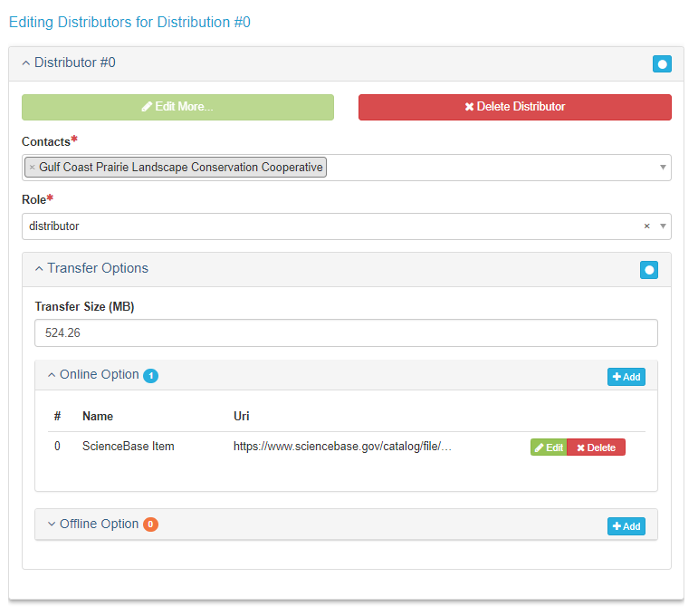

# Product Entry Guidance
The Product Entry Guidance section will cover how to create a metadata record for an AK-Region product.

***

## Before You Begin

### Select the lccProduct Profile:
After creating your product record and before you begin adding metadata, select **lccProduct** from the **Profile** drop down in the main menu. This will limit the number of available tabs and only show tabs that contain fields that are required for product creation.


### Make sure your [contacts](#contact-entry_guidance) are loaded into mdEditor:
In mdEditor, contacts are created separately from individual records, and then stored within a library in mdEditor. Once contacts have been entered or imported into mdEditor, they can be used in metadata records.

You should maintain a single list of your contacts in the program's archive folder (root folder that contains all project archive folders). Having duplicate copies of the same contact is not desirable. It can create confusion as you edit and manage your metadata records and introduce unnecessary errors.

***

## Edit a Product
1. Import or create your product record (see [workflow](#workflow)).
2. Choose the specific Resource Type that describes your product. Do not choose the generic "product."
3. Select the lccProduct Profile: from the Main Menu (Top Navigation Bar) select "lccProduct" from the profile drop-down menu.
4. Fill out metadata information for the following tabs:
  * [Main Tab](#product-main)
  * [Metadata Tab](#product-metadata)
  * [Keywords Tab](#product-keywords)
  * [Extent Tab](#product-extent)
  * [Taxonomy Tab](#product-taxonomy)
  * [Lineage Tab](#product-lineage)
  * [Distribution Tab](#product-distribution)
  * [Constraints Tab](#product-constaints)
  * [Dictionaries Tab](#product-dictionary)
5. If applicable, [associate](#product-associated) your products with other metadata records.

***

## Required Fields for Products

### Main Tab
* Title
* Status
* Language
* Resource Type
* Point of Contact
* Main Citation
  + Identifier
  + Online Resource URL
  + Responsible Parties
* Description
  + Abstract
* Time Period
  + Start Date
  + End Date

### Metadata Tab
* Metadata Contacts
* Metadata Identifier

### Keywords Tab
* ISO Topic Category
* GCMD Keywords (Best Practice)

### Extent Tab
* Geographic Extent

### Taxonomy Tab
* Taxonomic classifications

### Distribution Tab
* Distributor
  + Contact
  + Role
  + Online Option
    - URL

***

## Main Tab {#product-main}

The Main tab allows for the creation and/or editing of primary metadata.

| Quick Reference: Product Main Tab | Required? |
|:------|:-----|
| Basic Information: Title, Status | Required |
| Resource Type | Required |
| Point of Contact | Required |
| Citation: Title, Responsible Parties, Online Resource | Required |
| Citation: Alternative Titles, Date | Optional |
| Description: Abstact | Required |
| Time Period: Start Date, End Date | Required |

### Basic Information

#### Record ID (Required)
Will be auto-generated but can be edited.

#### Title (Required)
Enter as informative a title as possible. Good titles, when they appear in a search, will be understood and/or traceable.

#### Status (Required)
The Status drop-down menu allows you to select the status of your product. Choose status ONLY from the four following options: *completed, ongoing, proposed, or accepted*.


### Default Locale
**Default Locale** allows for the selection of **Language**, **Character Set**, and **Country**. English, UTF-8, and USA will be selected by default, but you may change them if necessary.


### Resource Types (Required)
The Resource Type should be automatically filled in with the resource type you selected when you created your record. Name is optional - you can leave this blank.

Products must have a specific resource type selected (not just "product").

### Points of Contact (Required)
Adding a point of contact gives users information on who to contact should they have a question regarding your project or product.

```{block, product_entry_points_of_contact-tip, type='rmdtip'}
To add contacts to a metadata record, you must first create/upload the contacts into mdEditor. See the Contact Section for more information.
```


#### Contacts

| Role | Contact | Required? |
|:------|:-----|:-----|
| pointOfContact | Identified in Roles and Responsibilities | Required |
| principalInvestigator | The Project PI | Best Practice |

The point of contact for a project should be identified with Roles and Responsibilities (see Interim DM Implementation Guide). This is an interim solution as the point of contact can become obsolete if there is a positional change within an organization. 


### Citation
The **Citation** describes pertinent information about your project such as: responsible parties, internal identifiers, and any online resources that may relate to your item. Adding information in the citation will also improve users' ability to find your items.

#### Citation Required Fields

##### Title (Required)
The citation title is automatically populated with the title of your record.

##### Alternate Title (Optional)
You can add an alternate title if desired, such as the Short Title used in the archive record.

##### Dates (Optional)
Enter *acquisition, creation, revision*, or another date reference from the picklist and then enter the date.

##### Responsible Parties (Required)
Responsible parties must include a point of contact, but may also include the other responsible parties identified in Roles and Responsibilities (see Interim DM Implementation Guide) such as custodian, editor (data steward), and administrator. 

```{block, product_entry_responsible_parties-tip, type='rmdtip'}
To add contacts to a metadata record, you must first create/upload the contacts into mdEditor. See the Contact Section for more information.
```


| Role | Contact | Required? |
|:------|:-----|:-----|
| pointOfContact | Identified in Roles and Responsibilities | Required |
| custodian | Best Practice |
| editor | Best Practice |
| administrator  | Best Practice |

##### Online Resource (Required, if available)
Enter the Name and URL for the project homepage, if available.

```{block, product_entry_online_resource-caution, type='rmdcaution'}
If the product metadata was created by copying another mdEditor metadata record, this identifier needs to be edited/changed since it will reflect the copied record identifier. Only the mdEditor UUID changes to represent a new record when an item is copied. Consult the [Copy Records](#copy-records) section of this manual to learn how to make a copy.
```

### Description
Description allows for the addition of the Abstract as well as a Short Abstract, and Supplemental Information.

#### Abstract (Required)
Enter an abstract that succinctly describes the project's purpose and goals. Include key species or habitats as well.

```{block, product_entry_abstract-tip, type='rmdtip'}
Write your project abstract in the present tense if the project is in progress and past tense if the project has been completed.
```

#### Short Abstract (Optional)
Enter a short description, limited to 300 characters, if desired.

Enter comments, if desired.

### Time Period

**Time Period** refers to project start and end date, or the date that the product was applicable (e.g., time that a map is valid, date of publication, date of presentation).

**Required**: For each product, add a start date and end date.


***

## Metadata Tab {#product-metadata}

Record Metadata includes a description that outlines the process of metadata creation, contributors to the creation of the metadata, and metadata repositories.

| Quick Reference: Product Metadata Tab | Required? |
|:------|:-----|
| Basic Information | Required |
| Metadata Contacts | Required |
| Metadata Identifier | Required |

### Basic Information

#### Metadata Status (Best Practice)
Select the appropriate status of the creation of your metadata from the drop down menu. For example, if you have added all of your metadata, select "completed." If you still have metadata to add, select "onGoing."

#### Dates (Best Practice)
Add at least one date. Recommended are "creation" (when you first created your metadata) and "lastUpdate" (when you updated metadata after initial publication).

### Metadata Contacts
Metadata Contacts are required. Adding a metadata contact will give users a contact point should they have any questions about the metadata.

| Role | Contact | Required? |
|:------|:-----|:-----|
| author | Identified in Roles and Responsibilities | At least one is required |
| pointOfContact | Identified in Roles and Responsibilities | Required |

### Metadata Identifier
The Metadata Identifier is automatically populated by mdEditor by generating a universally unique identifier (UUID). The metadata identifier gives each of your projects and products a unique ID and differentiates them from other similar projects and products.

```{block, product_entry_metadata_identifier-warning, type='rmdwarning'}
Once a Metadata Identifier is created in the metadata, do not change it. mdEditor uses the Metadata Identifier to connect records and changing the Metadata Identifier can break those connections. If there are additional identifiers you want to include in your metadata record, include them in Main/Citation/Identifier.
```

### Parent Metadata
[Under development]

### Metadata Repositories
[Under development]

***

## Keyword Tab {#product-keywords}

Adding keywords to your metadata record allows for the record to be found later through a search engine. Keywords are the way to tag your projects or products. The mdEditor is designed using thesauruses that contain pre-determined keywords.

| Quick Reference: Product Keywords Tab | Required? |
|:------|:-----|
| ISO Topic Category | Required |
| GCMD Keywords | Required |

### Add Keywords to your Product Record

1. Click “+ Add Thesaurus” on the right to add the different thesauruses.
2. From the drop down box, pick a thesaurus.
3. Add keywords from the following pre-populated thesauruses.
4. If none of the keywords in the following categories are sufficient for tagging your project, you can add other keywords with a custom thesaurus (see below for more information).

### ISO Topic Category Thesaurus (Required)
Because mdJSON metadata is based on the ISO (International Organization for Standardization) metadata standard, all products must select at least one ISO Topic Category. ISO topics were generally meant for spatial data so they might be a bit of a stretch, but do your best to find the best fit. mdEditor provides definitions of each ISO topic category if you hover over the ? icon.

ISO Topic List:
1. biota
2. boundaries
3. climatologyMeteorologyAtmosphere
4. economy
5. elevation
6. environment
7. geoscientificInformation
8. health
9. imageryBaseMapsEarthCover
10. intelligenceMilitary
11. inlandWaters
12. location
13. oceans
14. planningCadastre
15. society
16. structure
17.transportation
18 utilitiesCommunication

```{block, product_entry_biota-tip, type='rmdtip'}
Biota and environment are probably the best fit for most AK-Region products.
```

### GCMD Keywords Thesaurus (Best Practice)
GCMD stands for Global Change Master Directory and these keywords are maintained by NASA. Look for useful keywords in the GCMD Science Keywords. There are GCMD Platforms and Instruments Keywords but they are unlikely to apply to LCCs.

```{block, product_entry_full_path-tip, type='rmdtip'}
Check the "Full Path" checkbox to save the full path of the keyword to your metadata. This will maintain the category and context of the specific keywords chosen.
```

### Custom Thesaurus
If any of your desired keywords do not appear in the existing thesauruses, you can add them using a custom thesaurus. Use a custom thesaurus only for keywords that are not available in an existing thesaurus.

You cannot add keywords to an existing thesaurus; you can only add keywords in a custom thesaurus.

You cannot save a custom thesaurus in mdEditor.

```{block, product_entry_custom_thesaurus-tip, type='rmdtip'}
If you have a consistent set of keywords that you use across your products, you could add these to a "template product" record in mdEditor and then modify the specific keywords you need for each product. See the workflow section for more info about using template records.
```


### Keywords and ScienceBase
[ Under development ]

***

## Extent Tab {#product-extent}

**Extent** refers to geographic boundaries for your project. Spatial extents lets users see at a glance the geographic footprint of your project and allows searching within specific geographic areas.

| Quick Reference: Product Extent Tab | Required? |
|:------|:-----|
| Extent | Required |

Spatial extents should be included for all applicable products. As a default, products can inherit extents from their parent project. 

```{block, product_entry_extent-tip, type='rmdtip'}
You can export, save, and import an extent to use for other projects or products.
```

See further information on Extents in [Project Extent entry guidance](#project-extent).

***

## Taxonomy Tab {#product-taxonomy}

| Quick Reference: Product Taxonomy Tab | Required? |
|:------|:-----|
| Taxonomy | Required |

Please see the [Project Taxonomy entry guidance section](#project-taxonomy).

Taxonomy is required for projects and strongly recommended for products (where applicable). 

***

## Lineage Tab {#product-lineage}

Lineage is used to track the process of building spatial datasets. It's a space that can be used to describe the steps and sources used to create the product, and document the roles and contacts for the product contributors. Completing the lineage tab is recommended, but not required.

- **Statement** (Required): Notes actions taken to verify, transform, repair, and integrate the resource.
- **Process Step** (Optional): Consult the Process Step section below to learn how to add information about the creation of your project.
-**Sources** (Optional): Use the Sources field to indicate what you used to create the product and then write a statement. This can be done instead of completing all other fields in this tab.
-**Citation** (Optional): If you have a citation for a manual, enter it here. This can be done instead of completing all other fields in this tab.
-**Scope** (Optional): Select type from the picklist.


### Process Step
**Process Step** allows for documentation of the steps taken to build spatial data.

*The following are available and required:*
-Step ID: (Auto filled depending on the number of Process Steps added).
-Description: Add a description of the process step.

*The following fields are available but optional:*
-**Step Sources**: Information about the source data used in the process step.
-**Step Products**: Information about an intermediate data set.
-**Processors**: Processors of the process step.
  + Select or enter a role from the **Role** drop-down and select a contact from the **Contacts** drop down.
  + Consult the [Contacts](#contacts) section of this manual to learn about adding contacts.
- **Step Reference**: Add a citation noting your step process references.
- **Time Period**: Add a time period noting the **Start Date, End Date**, and **Fiscal Year**.
  + **ID**: Add a unique identifier for the time period.
  + **Description**: Add a description of the time period.
  + **Time Period Name**: Add a name for your time period.
  + **Interval**: Enter an **Interval Amount** and **Time Unit** of the time period.
  + **Duration**: Describe the time period in terms of **Years, Months, Days, Hours, Minutes**, and **Seconds**.
- Scope: Select the type of resource from the drop-down menu.


***

## Distribution Tab {#product-distribution}

**Distribution** provides documentation on how or where users can obtain products. Distribution methods may include online options (e.g., website, database) or offline options (e.g., delivery via mail, library).

An online distribution link is required for any products sent to data.gov.

| Quick Reference: Product Distribution Tab | Required? |
|:------|:-----|
| Contacts and Role | Required |
| Transfer Options: Online Option | Required |

Click **Add Distribution Section** and then **Edit Distributors** to begin adding distributors.

### Distributor
This section involves adding distributor information and a URL for data products that are hosted anywhere. For example, if The Nature Conservancy is hosting a data source, the distributor is "The Nature Conservancy."

#### Contacts and Role (Required)
If anything is filled out in the distribution section, a contact must be added. The appropriate role is "distributor."

The contact should ideally be someone who will remain available to respond to potential inquiries about the product. 

### Transfer Options (Required)
Transfer Options provide details regarding obtaining the product. Online and offline options are available.

#### Online Option (Required if Available)

**Name**
The Name of the online resource should be something that indicates it is a product page where the data can be downloaded. Examples: "product webpage" or "Product Webpage with Downloadable Files." If there are multiple files for a single product record, the Name should be different for each file so the user can differentiate between them. For example, "Download Aguiguan Veg 2016 data" or "Download FDM Veg 2011 data."

Unique Names for multiple files are particularly important for items being sent to data.gov. Without a name specified at all, the link will display as "webpage," which isn't particularly informative to users. Identical names for different files also won't be particularly informative.

**URL**
The most important thing to enter is the URL where the product can be accessed or downloaded.
An online link is required for any products sent to data.gov. Preferably the link should be a direct download to the data and not an intermediary page.

**Function**
In the Function field, you should indicate the type of URL. If the link is a direct download of the data, select “download.” If the link goes to an informational page, select “information.”

**How to obtain download link from ScienceBase Items**
[Under development]

**Offline Option**
If your product is only available offline, describe how users can obtain the product here.

### Example Distributor



***

## Constraints Tab {#product-constraints}

The Constraint tab allows you to enter information into the metadata about how the resource can and cannot be used.

| Quick Reference: Product Contraints Tab | Required? |
|:------|:-----|
| Use Limitation | Optional |
| Legal | Optional |
| Security Constaints | Optional |

### Use Limitation
Identify concerns over how people should or should not use the product.

If your product is licensed, let people know here. Typically files used will be public domain, but not always.


### Legal
- **Access Constraints**: Access constraints are applied to assure the protection of privacy or intellectual property and any special restrictions or limitations on obtaining the resource.
- **Use constraints**: How the product should be used.
- **Other constraints**: This is a place to put standard disclaimers.


### Security Constraints
A place to describe constraints or restrictions pertaining to security of the resource. Choose classification from the drop-down menu.

Classification is the class of security (e.g., top secret, public access).


***

## Dictionaries Tab {#product-dictionary}

Data dictionaries are required for tabular datasets.

Like Contacts, data dictionaries are created separately from Product records. Also like Contacts, Dictionaries can be reused across products and are stored outside the project archive folder in the program archive folder. See [Dictionary Entry Guidance](#dictionary-entry-guidance) for details. The Dictionaries tab links the product metadata record to a data dictionary that you have previously defined. 

Select the dictionary from the list of those available by checking the box next to the dictionary that describes the product.

***

## Associated Tab {#product-associated}

The **Associated section** is used to connect metadata records with each other. This feature should be used when items are related. For example, products are often the result of projects, and projects can have sub-projects. Projects and Products can be linked together by using association. 

### Create Associations
In mdEditor you can either create the association from the Project record or the Product record. The "Association Type" will define the association from your current record to the linked record. Specifying the "Linked Association Type" will create the association from the other direction.

*Important: It is recommended you ALWAYS specify the Linked Association Type when you create associations. This will ensure the associations are defined from both directions and be present in the metadata no matter how the metadata is translated or where it is used in the future.*

**Quick Reference: Creating an Association in a Product Record**
1. Select "parentProject" from the Association Type drop-down menu.
2. Use the Select a Record button to select an associated project.
3. Choose the project that you would like to associate from the "Select a Resource" list.
4. Fill out the Linked Association Type with "product."

#### Step-by-Step: Creating an Association in a Product Record

**Step 1**: Select **parentProject** from the **Association Type** drop-down menu. This field will describe the relationship from the associated record to the product record (the associated record is the parentProject of the product record you are editing).


**Step 2**: Click the **Select a Record** button to select an associated project.


**Step 3**: Choose the project that you would like to associate from the **Select a Resource** list.


**Step 4**: Fill out the Linked Association Type with **product**.


